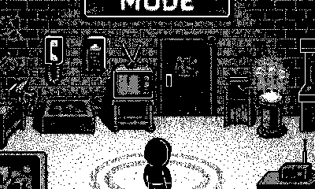
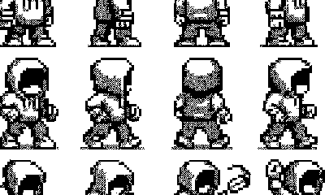
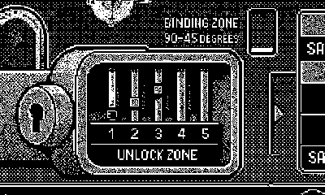
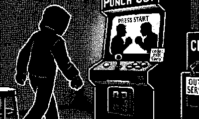

# PWNGLOVE MODE Concept Art

4 concept frames generated via the 23 Studios image pipeline (`openai/gpt-5-image` via OpenRouter, dithered to 1-bit through `pulp_ai.toScenePng`).

**Style anchors:** ONLY the 3 reference images at `/home/hakcer/projects/reference/`:
- `ref_farming.png` — Stardew-Valley-style 1-bit farming RPG screenshot
- `ref_sidescroller.png` — Playdate side-scroller beach scene (first frame of `a-new-side-scroller-for-the-playdate-i-hope-to-finish` GIF)
- `ref_snowy.png` — "The Whiteout" snowy cabin night scene

All prior style anchors (Lucas Pope, Mars After Midnight) were dropped per the user's "ignore everything else" directive. Prompts describe scene content only; visual style is carried by the references.

---

## Concepts

### 1. Playground room overview

Top-down view of the 1998 hacker basement workshop. Nine workstations + neon `PWNGLOVE MODE` banner + newb sprite center-bottom.

### 2. Newb sprite sheet

4×4 grid of character poses: 4 idles (N/S/E/W) + 8 walk-cycle frames + 4 action poses (interact / surprised / lockpicking / cranking). Hooded teen in baggy jeans + chunky sneakers + visible PWNGLOVE on left forearm.

### 3. Lockpick station UI

Full Playdate 400x240 framing of the lockpick minigame. Top bar with puzzle/attempt/timer/status. Center: 5-pin brass cutaway + compass with AIM indicator. Right: STOP/CARE/SAFE tension meter. Bottom: controls strip + newb dialog bar.

### 4. Tyson arcade corner

Side-vignette of the Mike Tyson's Punch-Out!! cabinet bolted to the back wall. CRT title screen + coin slot + 1987 etched in glass + hooded newb approaching mid-stride.

---

## Generation parameters

- **Model:** `openai/gpt-5-image` (OpenRouter)
- **Dim:** 400×240 (Playdate native; generated at 800×480 with 2× nearest-neighbor downsample)
- **Dither:** Atkinson 1-bit via `pulp_ai.toScenePng`
- **References attached:** all 3 user refs per concept
- **Guidance scale:** 8.5
- **Style-match directive:** prepended by `pulp_ai.generateScene` when refs resolve

Reproducer at `/tmp/gen_pwnglove_concepts.js` (monkey-patches `references.resolveReferenceFile` to resolve filenames from `/home/hakcer/projects/reference/` regardless of projectId).

## Generation times (per concept)

| Concept | Wall time | Bytes |
|---|---|---|
| playground_room_overview | 84.0s | 9,455 |
| newb_sprite_sheet | 77.9s | 7,462 |
| lockpick_station_UI | 178.3s | 8,880 |
| tyson_arcade_corner | 111.5s | 7,818 |

Total: ~7.5 minutes of OpenRouter compute. All 4 succeeded on first attempt.
